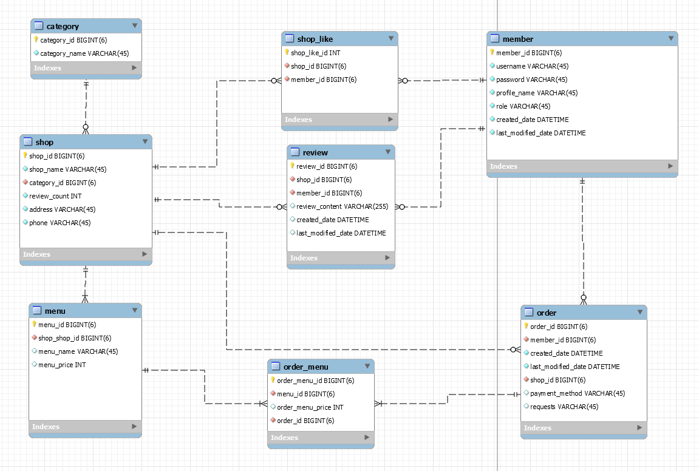

# Delivery Project

## S.A 문서 링크
https://www.notion.so/SA-a3e072c2f30d412faf15127acc80b042?pvs=4

1. 프로젝트 개요

- 1-1 팀명 : Alt+F4
        - 프로젝트 참여자
        
        [팀원 소개](https://www.notion.so/2d3ce22af35b4bd6a91e5bff4fdefa6d?pvs=21)
        
    - 1-2 프로젝트 명칭 : 배달의 만족
    - 1-3 프로젝트 목적 또는 기능 : 배달주문 플랫폼
    - 1-4 프로젝트 일정 : 2023/07/17 ~ 2023/07/24
    - 1-5 프로젝트 운영 방식 및 룰
        
        
        | 프로젝트 운영 방식 | 예시 |
        | --- | --- |
        | 중간점검 및 회의 | 아침회의(오늘 할 것), 
        점심후(개발진행 현황), 
        마칠 때(개발 진행 현황 및 내일 할것 브리핑) |
        | 커밋메시지 간단한 설명 | 구현기능 + 한줄설명 +(추가적 상세내용) |
        | JavaScript, Java 함수명 : 카멜케이스 | getUser(), getProduct(), etc..
         |
        | RESTful API 명 : 복수형 : 스네이크 케이스 | members, meuns, orders |
        | DB테이블 명 : 단수형 : 스네이크 케이스 | member, menu |
        | 프로젝트 환경 (사용 기술) | Java JDK Zulu 17.0.7 
        Spring Framework 3.1.1
        MySql
         |
        
    - 1-6 프로젝트 내의 역할
        
        메뉴+ 주문 / 리뷰+좋아요 / 가게+ 카테고리 / 멤버 +jwt security
        
        ++기능에 해당하는 프론트
        
        | 팀원 | 역할 |
        | --- | --- |
        | 강정훈 | 가게+카테고리 CRUD |
        | 전창민 | 멤버CRUD +jwt security(로그인) + 주문&장바구니CR |
        | 심형철 | 리뷰+좋아요
        VIEW : 리뷰작성, 리뷰수정 |
        | 송병민 | 메뉴+ 주문 |
    
    - 1-7 프로젝트 체크리스트
        
        <aside>
        ✅ **프로젝트 구현 기능 체크리스트**
        
        ## `필수 기능`
        
        - [x]  **사용자 인증 기능**
        - 회원가입 기능
            - username, password를 Client에서 전달받기
            - username은  `최소 4자 이상, 10자 이하이며 알파벳 소문자(a~z), 숫자(0~9)`로 구성되어야 한다.
            - profilename은 `최소 2자 이상, 10자 이하이며 알파벳 소문자(a-z), 대문자(A-Z), 한글(가-힣), 숫자(0-9)로 구성되어야 한다.`
            - password는  `최소 8자 이상, 15자 이하이며 알파벳 대소문자(a~z, A~Z), 숫자(0~9), 특수문자`로 구성되어야 한다.
            - DB에 중복된 username이 없다면 회원을 저장하고 Client 로 성공했다는 메시지, 상태코드 반환하기
            - 회원 권한 부여하기 (ADMIN, USER) - ADMIN 회원은 모든 주문, 리뷰, 수정 / 삭제 가능, 좋아요 관리
                
            
        - 로그인 및 로그아웃 기능
            - username, password를 Client에서 전달받기
            - DB에서 username을 사용하여 저장된 회원의 유무를 확인하고 있다면 password 비교하기
            - 로그인 성공 시, 로그인에 성공한 유저의 정보와 JWT를 활용하여 토큰을 발급하고, 
            발급한 토큰을 Header에 추가하고 성공했다는 메시지, 상태코드 와 함께 Client에 반환하기
        - [x]  **프로필 관리**
            - 프로필 수정/삭제 기능
                - 이름, 한 줄 소개와 같은 기본적인 정보를 볼 수 있어야 하며 수정할 수 있어야 합니다.
                - 비밀번호 수정 시에는 비밀번호를 한 번 더 입력받는 과정이 필요합니다.
                - 최근 3번안에 사용한 비밀번호는 사용할 수 없도록 제한합니다.
                - 프로필 정보를 삭제할 수 있다.
        
        - [x]  메뉴 CRUD 기능
            - 메뉴 생성, 조회, 수정, 삭제 기능
                - 메뉴조회를 제외한 생성, 수정, 삭제 기능들은 인가(Authorization) 개념이 적용되어야 하며, JWT 토큰 검증이 되어야 한다.
                - 메뉴 수정/삭제는 ADMIN으로만 기능을 수행한다.
                
        - [x]  가게 CRUD 기능
            - 가게 조회, ~~생성, 수정, 삭제~~ 기능
                - 가게 조회를 제외한 생성, 수정, 삭제 기능들은 인가(Authorization) 개념이 적용되어야 하며, JWT 토큰 검증이 되어야 한다.
                - ~~생성, 수정, 삭제~~ - Dummy 데이터 사용
            
        - [x]  주문 CRUD 기능
            - 주문 작성, 조회, 수정, 삭제 기능
                - 주문조회, 생성, 수정, 삭제 기능들은 인가(Authorization) 개념이 적용되어야 하며, JWT 토큰 검증이 되어야 한다.
                - 사용자는 주문을 생성할 수 있다.
                - 사용자는 주문한 목록을 조회, 수정, 삭제할 수 있다.
                - 사용자는 본인이 주문한 목록에 대해서 수정/삭제가 가능하다.
        
        - [x]  리뷰 CRUD 기능
            - 리뷰 작성, 조회, 수정, 삭제 기능
                - 주문자들만 주문건에 대해서 리뷰를 생성 할 수 있어야 합니다.
                - 주문자는 본인의 리뷰를 수정 및 삭제를 할 수 있어야 합니다.
                - 또한, 주문과 마찬가지로 리뷰 조회를 제외한 나머지 기능들은 인가(Authorization)개념이 적용되어야 합니다.
            
            
        
        ## `추가 기능`
                
        - [x]  **백오피스 만들어보기** **[⭐](https://emojipedia.org/star/)**
            - **백오피스** 란 서비스를 제공하기 위하여 상품을 등록하고 마케팅을 설정하고 결제와 매출, 수익 등을 관리하는 서비스를 제공하는 페이지입니다.
            - 일반적으로 관리자 사이트, ERP 도구 등으로 표현됩니다.
            - 저희는 간단하게 관리자 페이지를 만든다고 생각하면 좋습니다.
            - 유저 전체 목록을 조회하고 권한을 수정/삭제하며 관리할 수 있습니다.
            - 게시글, 댓글 전체 목록을 조회하고 수정/삭제하며 관리할 수 있습니다.
            - 배달앱이라면 메뉴, 주문, 리뷰 전체 목록을 조회하고 생성/수정/삭제 기능을 통해 관리할 수 있습니다.
            
            
            일반적인 회원관리 페이지
            
            - 관리자페이지 구성
                - 회원종류를 일반회원과 관리자 회원으로 분리
                - 회원 관리 또는 게시글 관리 화면 추가 / 혹은 동일 화면이라하더라도 더 많은 버튼과 기능을 사용할 수 있게 해주세요
                    - 회원 관리(예시 기능)
                        1. 회원 조회하기
                        2. 사이트 회원 정보 수정하기
                        3. 사이트 회원 삭제하기
                        4. 회원 운영진으로 승격
                        5. 회원 차단하기
                            1. user모델과 tokenobtainpairview 수정이 필요합니다.
                    - 게시글 관리(예시 기능)
                        1. 공지글 등록하기
                        2. 모든 게시글 수정하기
                        3. 모든 게시글 삭제하기
                    - 메뉴/주문 관리(예시 기능) - 배달앱
                        1. 메뉴판 수정 하기
                        2. 모든 주문 수정하기(완료처리)
                        3. 모든 주문 삭제하기
            
        - [x]  **프론트엔드 만들어보기**
            - 백엔드에서 제공하는 API를 통해 서버와 통신하는 프론트엔드를 구현합니다.
            - 와이어프레임에 나온 명세를 최대한 구현해보면 금상첨화겠죠?
            - 웹개발 종합반에서 배웠던 부트스트랩을 활용해봐도 좋아요.
            - AWS S3 혹은 netlify, vercel, github pages 와 같은 서비스로 프론트 배포할 것
            
        - [x]  좋아요 기능
            - 가게 좋아요 등록, 취소 기능
                - 사용자는 특정 가게에 좋아요와 취소를 할 수 있다.
                - 또한 좋아요/취소 시 인가(Authorization) 개념이 적용되어야 한다.
            - 가게는 좋아요 조회할 수 있다.
        
        </aside>

        
- `2. 와이어프레임`
    
    https://www.figma.com/file/1qYGmbZyII72u0ZN4BcLEh/%EB%B0%B0%EB%8B%AC%EC%9D%98-%EB%A7%8C%EC%A1%B1?type=design&node-id=0%3A1&mode=design&t=GFXcW8rbSCAPoh3w-1
    
        
    
- `3. ERD 설계`

초기 ERD

  
  
        
       
        
    
    
    
- `4. API 설계`
    
    [API 명세서](https://www.notion.so/18f3e143b0fd460cb974a6fbb063b86f?pvs=21)
